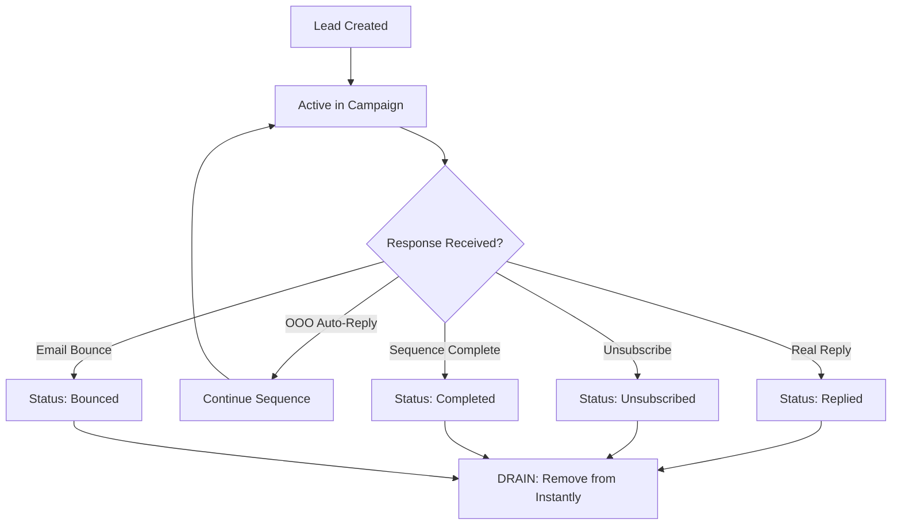

# Cold Email System Analysis: OOO/Automated Response Problem

## 🔍 Current Status Analysis

### Problem Identified
The current `get_finished_leads()` function in `sync_once.py` (lines 183-194) **returns an empty list by design**, meaning the DRAIN phase is completely non-functional. This is actually **preventing** the OOO problem from occurring, but it's also preventing legitimate lead cleanup.

### Key Findings

#### 1. **DRAIN Phase is Disabled**
```python
def get_finished_leads() -> List[InstantlyLead]:
    """Get leads with terminal status from Instantly."""
    try:
        # For now, return empty list since we need to implement lead status tracking differently
        # The API doesn't have a direct "get leads by campaign" endpoint
        # We'll track status through our own BigQuery tables
        logger.info("Skipping drain - will be implemented with lead status tracking")
        return []
    except Exception as e:
        logger.error(f"Failed to get finished leads: {e}")
        return []
```

#### 2. **API Endpoint Discovery Results**
After testing multiple endpoint patterns, I found:
- ✅ `/api/v2/campaigns/{campaign_id}` - Works (campaign metadata)
- ❌ `/api/v2/campaigns/{campaign_id}/leads` - 404 Not Found
- ❌ `/api/v1/campaign/{campaign_id}/leads` - 404 Not Found  
- ❌ `/api/v2/leads` - 404 Not Found
- ❌ All other lead listing endpoints - 404 Not Found

#### 3. **Campaign Configuration Insights**
The SMB campaign has these relevant settings:
- `stop_on_reply: true` - Stops sequences when real replies are received
- `stop_on_auto_reply: false` - **Does NOT stop on automated replies (OOO)**
- `status: 1` - Campaign is active

This configuration is actually **correctly set** to avoid the OOO problem at the sequence level.

#### 4. **Current Lead Status Tracking**
The system uses BigQuery tables for tracking:
- `ops_inst_state` - Current lead states (email, campaign_id, status, instantly_lead_id)
- `ops_lead_history` - 90-day cooldown tracking
- Lead statuses are: 'active', 'completed', 'bounced', 'unsubscribed', 'replied'

## 🚨 The Real Issue

### Root Cause
The system was designed to drain leads based on status from the Instantly API, but **the API endpoints to fetch leads with status don't exist** (or are not publicly available). This left the drain functionality incomplete.

### Current Behavior
1. **DRAIN Phase**: Skipped entirely (empty list returned)
2. **TOP-UP Phase**: Adds new leads normally
3. **Lead Accumulation**: Leads stay in Instantly indefinitely
4. **Inventory Growth**: System will hit the 24,000 lead cap eventually

## 📊 Status Tracking Analysis

### How Status Updates Should Work


### Current Implementation Gap
The system lacks the mechanism to detect when leads transition from "active" to terminal states because:
1. No working API endpoint to fetch leads with status
2. No webhook integration for real-time status updates
3. No alternative data source identified

## 🔧 Potential Solutions

### Solution 1: Alternative API Endpoints (Investigation Needed)
```bash
# Test these potential endpoints:
/api/v2/account/activity
/api/v2/campaigns/{id}/analytics
/api/v2/campaigns/{id}/statistics  
/api/v2/export/leads
/api/v1/leads/export
```

### Solution 2: Webhook Implementation
```python
# If Instantly supports webhooks for status changes:
@app.route('/webhook/instantly', methods=['POST'])
def handle_instantly_webhook():
    data = request.json
    if data['event'] == 'lead_status_changed':
        update_lead_status(data['lead_id'], data['new_status'])
```

### Solution 3: Email Parsing Integration
```python
# Parse incoming emails to detect replies/OOO
def analyze_reply_content(email_content):
    ooo_patterns = [
        'out of office', 'vacation', 'auto-reply',
        'temporary away', 'will not be available'
    ]
    return any(pattern in email_content.lower() for pattern in ooo_patterns)
```

### Solution 4: Time-Based Status Inference
```python
# Infer status based on campaign activity and time
def infer_lead_status_from_activity():
    """
    If a lead hasn't had activity for X days and sequence is complete,
    mark as 'completed' and drain
    """
    pass
```

## 📋 Immediate Action Plan

### Phase 1: API Investigation
1. **Test Additional Endpoints** - Look for analytics, export, or activity endpoints
2. **Check Instantly Documentation** - Search for lead status retrieval methods
3. **Contact Instantly Support** - Ask about lead status tracking capabilities

### Phase 2: Temporary Status Management
```python
def get_finished_leads_v2() -> List[InstantlyLead]:
    """
    Temporary implementation using time-based inference
    """
    # Query BigQuery for leads older than X days
    # Mark them as completed if no recent activity
    # Return for draining
```

### Phase 3: Smart Filtering Implementation
```python
def is_automated_reply(reply_content: str) -> bool:
    """
    Detect OOO and automated responses to avoid premature draining
    """
    automated_indicators = [
        'out of office', 'ooo', 'auto-reply', 'automatic reply',
        'vacation', 'holiday', 'away from office'
    ]
    return any(indicator in reply_content.lower() for indicator in automated_indicators)
```

## 🎯 Recommendations

### Short Term (Fix the Immediate Issue)
1. **Keep drain disabled** until proper API endpoint is found
2. **Monitor lead inventory** approaching 24k limit
3. **Implement manual cleanup** script if needed

### Medium Term (Proper Solution)
1. **Find working API endpoint** for lead status
2. **Implement proper drain logic** with OOO detection
3. **Add webhook support** if available

### Long Term (Robust System)
1. **Email parsing integration** for reply analysis
2. **Machine learning** for automated response detection
3. **Real-time status synchronization**

## ⚠️ Current Risk Assessment

- **Risk Level**: MEDIUM
- **Impact**: System will eventually hit inventory cap
- **Urgency**: Need solution within 30-60 days
- **Workaround**: Manual cleanup or increased inventory limits

The OOO problem isn't currently occurring because drain is disabled, but we need a proper solution to handle lead lifecycle management effectively.